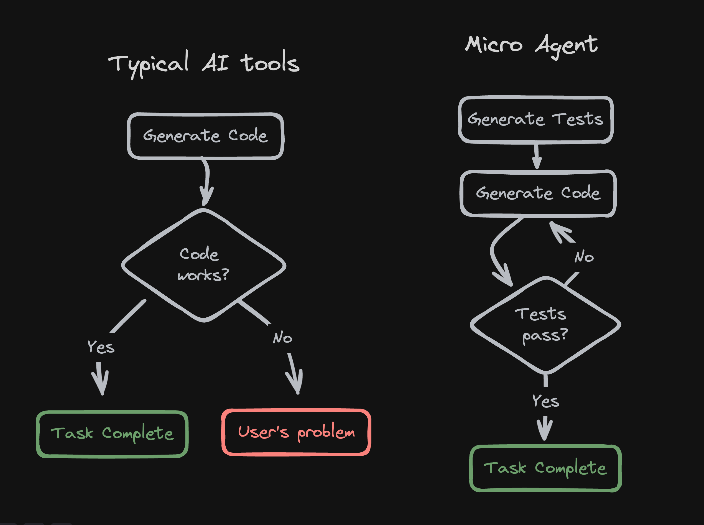

This deno function is inspired by [Micro Agent](https://github.com/BuilderIO/micro-agent) but goes further by allowing this functionality to be done in the cloud using a simple API call from within a serverless environment.

Besides just the tests and the code, it also provides the user with an API endpoint for the function that is directly accessible.

Previous eval experiments:

- [v1 - Run untrusted code using QuickJS WASM on Cloudflare](https://github.com/janwilmake/evaloncloud-v1)
- [v2 - Eval untrusted code from URL on Deno with caching](https://github.com/janwilmake/evaloncloud-v2)
- [v3 - Evals any code as if it were a map](https://github.com/janwilmake/evaloncloud-v3)

[Docs](https://janwilmake_microagent-serverless.githuq.com/openapi.html) | [Demo](https://janwilmake_microagent-serverless.githuq.com/index.html)
